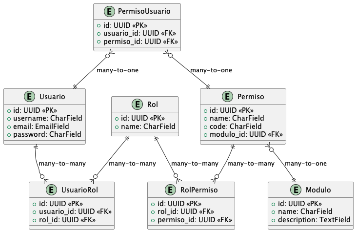

# Sistema de Seguridad para ERP en Django

## Descripción del Proyecto

Este proyecto es un sistema de seguridad diseñado para un ERP (Enterprise Resource Planning) que gestiona la autenticación y autorización de usuarios. El sistema garantiza que cada usuario solo pueda acceder a la información y realizar las acciones que le corresponden según su rol y permisos dentro de la organización. El sistema utiliza JSON Web Tokens (JWT) para la autenticación y un middleware personalizado para la autorización basada en permisos.

## Stack Tecnológico

- **Lenguajes**: Python
- **Frameworks**: Django, Django Rest Framework
- **Base de Datos**: PostgreSQL
- **Autenticación**: JSON Web Tokens (JWT) mediante `djangorestframework-simplejwt`
- **Documentación**: Swagger UI mediante `drf-spectacular`
- **Contenedores**: Docker (opcional)

## Instrucciones para Ejecutar el Proyecto

Sigue los pasos a continuación para configurar y ejecutar el proyecto en tu entorno local.

### 1. Clonar el Repositorio

```bash
git clone https://github.com/tu-usuario/tu-repositorio.git
cd tu-repositorio
```

### 2. Crear y activar un entorno virtual
```bash
python3 -m venv venv
source venv/bin/activate
# En Windows: env\Scripts\activate
```

### 3. Instalar las Dependencias
```bash
pip install -r requirements.txt
```

### 4. Ejecutar el contenedor de postgresql (opcional)
```bash
docker-compose up -d
```

### 5. Ejecutar las migraciones
```bash
python manage.py makemigrations
python manage.py migrate
```

### 6. Ejectuar el servidor de desarrollo
```bash
python manage.py runserver
```

### 7. Acceder a la documentación de la API (Swagger UI)
Abre tu navegador y accede a la URL ` http://127.0.0.1:8000/api/schema/swagger-ui/`


## Modelo de datos del Sistema
La siguiente imagen muestra el modelo de datos del sistema de seguridad: 




